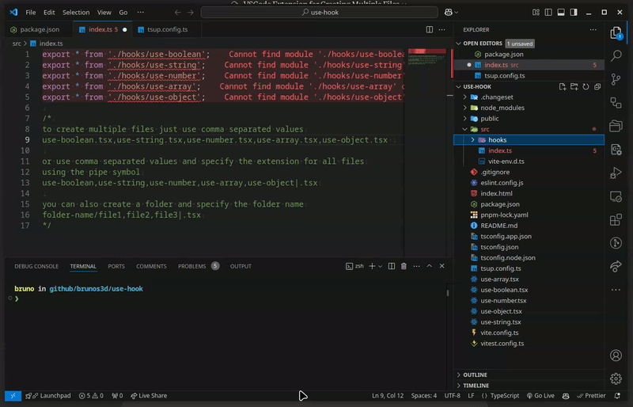

# Multiple Files Creator

## Overview

The Multiple Files Creator extension for Visual Studio Code allows you to create multiple files at once using a comma-separated list. This is especially useful for quickly setting up project structures.

## Features

- Create multiple files in one go.
- Supports nested folder structures.
- Optionally specify file extensions for all files using a pipe (`|`) syntax.
- Adds a "New Files..." option in the context menu of the Explorer view.

## Demo

## Installation

1. Open Visual Studio Code.
2. Go to the Extensions view by clicking on the Extensions icon in the Activity Bar on the side of the window or by pressing `Ctrl+Shift+X`.
3. Search for "Multiple Files Creator".
4. Click "Install" to install the extension.

## Usage

### Using the Command Palette

1. Open the Command Palette by pressing `Ctrl+Shift+P` (or `Cmd+Shift+P` on macOS).
2. Type `New Files...` and select the `New Files...` command.
3. Enter the file names separated by commas. For example: `file1.tsx,hooks/file2.tsx,file3.tsx`.

### Using the Context Menu

1. Right-click on a folder in the Explorer view.
2. Select `New Files...` from the context menu.
3. Enter the file names separated by commas. For example: `file1,hooks/file2,file3|.tsx`.

## Examples

### Basic Usage

- Input: `file1.tsx,hooks/file2.tsx,file3.tsx`
- Result:
  - `file1.tsx`
  - `hooks/file2.tsx`
  - `file3.tsx`

### Using Pipe Syntax for Extensions

- Input: `file1,hooks/file2,file3|.tsx`
- Result:
  - `file1.tsx`
  - `hooks/file2.tsx`
  - `file3.tsx`

### Creating Nested Folders

- Input: `file1.tsx,hooks/file2.tsx,file3.tsx`
- Result:

  - `file1.tsx`
  - `hooks` (folder)
    - `file2.tsx`
  - `file3.tsx`

- Input: `file1,hooks/file2,file3|.tsx`
- Result:
  - `file1.tsx`
  - `hooks` (folder)
    - `file2.tsx`
  - `file3.tsx`

## Contributing

If you find any issues or have suggestions for new features, please open an issue or submit a pull request on [GitHub](https://github.com/brunos3d/vscode-new-files).

## License

This extension is licensed under the [MIT License](LICENSE).
